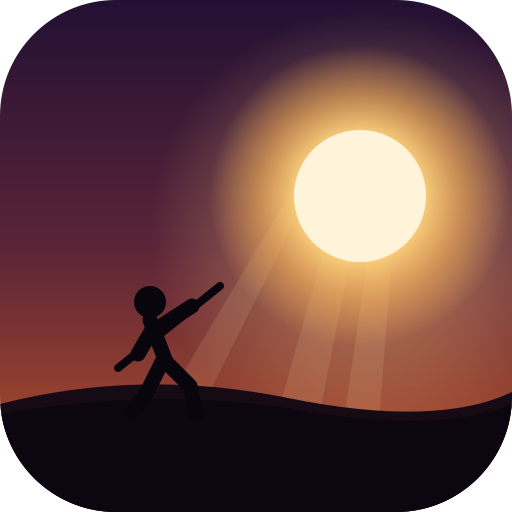
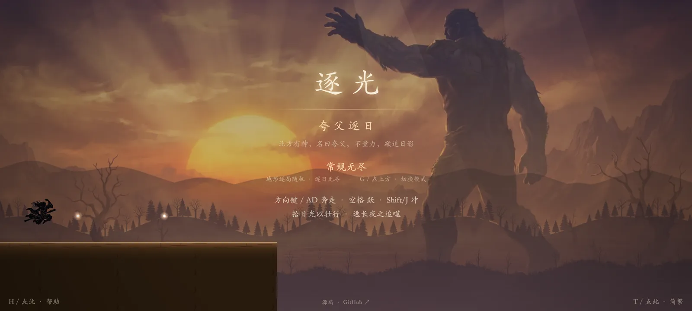
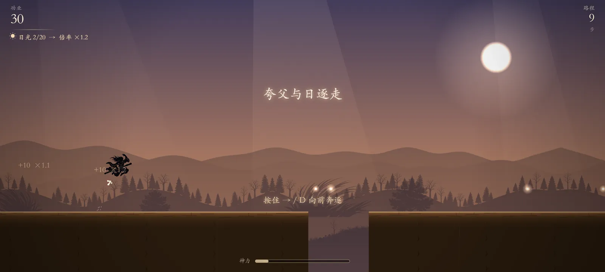
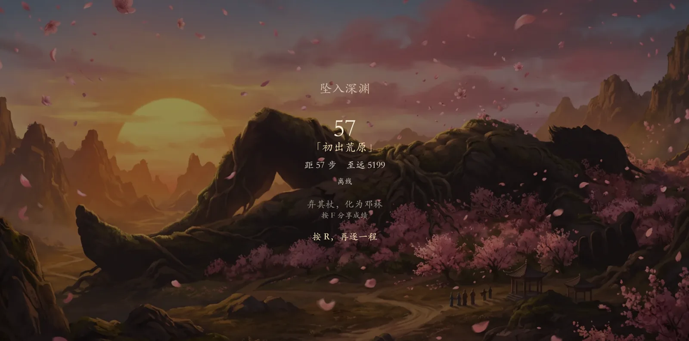

# 빛을 좇다 · 과보축일

> 실루엣 신화 러너: 과보가 되어, 결코 닿을 수 없는 해를 좇다

 

**[▶ 온라인 플레이](https://kuafu.newzone.top)**

[简体中文](../../README.md) · [繁體中文](README.zh-Hant.md) · [English](../../README.en.md) · [日本語](README.ja.md) · **한국어**

> 북방에 신이 있어 이름을 과보라 하니, 힘을 헤아리지 않고 해를 좇았다.

실루엣 풍의 거친 들에서 과보가 되어, 영영 닿을 수 없는 해를 좇는다: 햇빛을 거두어 배율을 올리고, 샘물을 떠 질주를 잇고, 한발과 금오를 부수고, 신력이 차면 한 걸음에 화면 하나를 건너뛴다. 뒤에서 다가오는 긴 밤에 삼켜지기 전에 얼마나 멀리 갈 수 있는가.

흔한 무한 러너와 달리, 천지는 『산해경』의 기록을 끝까지 따라 걷는다 — 새벽의 출발, 황하와 위수를 마시고, 길에서 목말라 죽고, 지팡이를 던져 등림이 된다. 마지막 장을 넘어서도 끝이 아니다. 등림의 달밤과 대황의 별벌판은 충분히 멀리 간 사람만이 본다.

## 지원 범위

| 항목 | 지원 범위 |
| --- | --- |
| **기기** | 데스크톱(키보드) · 휴대폰 / 태블릿(화면 터치 버튼). 세로로 들면 전체 시야를 위해 가로로 돌리라고 안내한다 |
| **브라우저** | 빌드 타깃 ES2022 — Chrome / Edge 94+, Safari 15.4+, Firefox 93+ |
| **설치** | 필요 없다. 페이지를 열면 바로 논다 — 내려받기도, 계정도, 가입도 없다 |
| **네트워크** | 게임은 처음부터 끝까지 브라우저 안에서 돈다. 직접 기록을 제출할 때만 통신한다(아래 참조) |
| **저장** | 최고 기록·언어 설정·직접 올린 모습은 브라우저 로컬에 남고, 올라가지 않는다 |
| **엔진** | 의존성 없는 자체 Canvas 2D, 게임 프레임워크 없음. 순위표는 Cloudflare Worker + D1(선택) |

> 게임 자체는 처음부터 끝까지 당신의 브라우저 안에서 돈다. 네트워크를 쓰는 것은 **직접 기록을 제출할 때**뿐이며, 나가는 것은 당신이 입력한 닉네임과 그 판의 기록(점수·노정·시간·순위표 구분)뿐이다 — 계정도, 쿠키도, 다른 식별자도 없다. 제출하지 않으면 전혀 통신하지 않는다. 자체 백엔드를 세우려면 [DEVELOPMENT.md](../../DEVELOPMENT.md)를 보라.

## 플레이 방법

**핵심 흐름**: 앞으로 달린다 → 갈라진 땅과 심연·가시를 넘는다 → 「햇빛」을 거두어 배율을 올리고 신력을 쌓고, 「샘물」을 떠 질주를 잇는다 → 질주로 한발을 부수고 금오를 물리친다 → 신력이 차면 「과보의 도보」로 한 화면을 건넌다 → 뒤쫓는 「긴 밤」에 삼켜지기 전에 더 멀리. 긴 밤에 따라잡히면 한 판이 끝난다.

**점수**: `공업 = 노정 × 배율`. 햇빛을 하나 거둘 때마다 배율 +0.1(최대 ×3). 처치와 몸놀림에도 가점이 있다. 멀리 갈수록, 배율이 높을수록 공업은 커진다.

**신력과 필살기·과보의 도보**: 햇빛과 처치로 신력 게이지가 찬다. 가득 차면 `K`로 도보 — 먼저 공중으로 떠오른 뒤 한 화면을 가로지르며 길목의 모든 것을 부수고, 착지 후 3초간 무적이다. 위기를 벗어나고 점수를 밀어 올리는 열쇠다.

**적**: `한발`(가뭄의 귀신)과 `금오`(열 개의 해의 까마귀). 질주나 도보 중에 부딪히면 부수어 점수가 되지만, 맨몸으로 닿으면 죽는다.

**긴 밤이 다가온다**: 뒤쫓는 긴 밤은 점점 빨라져 결국 그대를 앞지른다. 일정 거리까지 다가오면 화면 가장자리가 어두워지고 심장 소리가 더해진다 — 가까울수록 더 급하게 뛴다. 심장 소리가 들리면 길 위의 햇빛을 더 탐하지 마라.

**풍경은 일을 따라 옮겨간다**: 황하·위수와 대택 구간에서는 물빛이 떠오르고, 해에 들어선 구간에서는 열기가 피어오르며, 마지막 장에서는 복숭아 숲이 드러나고 해가 서쪽으로 기운다. 마지막 장을 넘어서도 멈추지 않는다 — **등림의 달밤 → 대황의 별벌판 → 서광의 재림**, 멀리 간 자만이 본다.

**칭호와 공유**: 그 판의 공업에 따라 칭호가 주어진다 — `거친 들에 나서다` → `해를 좇는 자` → `황하와 위수를 마신 자` → `북으로 대택을 마시다` → `과보의 뜻` → `해와 빛을 나란히`. 결산 화면에서 `F`를 누르면(터치는 위쪽 절반을 누르면) 기록 카드(결말 그림 + 공업 + 칭호 + 주소)가 만들어지고, 그대로 공유할 수 있다.

**모습 바꾸기**: 제목 화면과 결산 화면 모두에 「모습 바꾸기」가 있다. `옥토끼` `응룡` `형천` `예` `비천` `고양이` 여섯 실루엣이 들어 있고, 「＋」를 누르면 자기 그림을 주인공으로 삼을 수도 있다. 그림은 브라우저 안에서 줄여 로컬에 남으며 **올라가지 않는다**. 한 장뿐인 모습에는 달리는 율동을 프로그램이 붙여 준다 — 흔들리는 것은 다리뿐, 머리는 거의 고정된다. 도약에서는 늘어나고 질주에서는 앞으로 기운다. 그러니 얼굴 사진을 넣어도 눈이 어지럽지 않게 제법 그럴듯하게 달린다.

## 모드

| 모드            | 설명                                                                                       |
| --------------- | ------------------------------------------------------------------------------------------ |
| **무한**        | 지형은 판마다 새로이, 축일은 끝이 없다. 「천하 축일 순위」를 겨룬다                        |
| **오늘의 시련** | 전 세계가 같은 날 같은 씨앗·같은 관문. 몇 번을 다시 해도 같은 지도. 「오늘의 순위」로 날마다 새로워진다 |

제목 화면에서 `G`를 눌러(터치는 화면 위쪽을 눌러) 모드를 바꾼다. 오늘의 시련 띠에는 그날의 날짜가 나온다(씨앗은 UTC 날짜로 배포된다). 결산 화면에는 상위 다섯이 나열되며, 그 안에 들었다면 자기 줄에 불이 켜진다.

## 조작

제목 화면에서 아무 키나 누르거나 화면을 터치하면 시작된다. 터치 기기에서는 플레이 중 반투명한 버튼이 나온다(왼손 「뒤 / 앞」, 오른손 「도약 / 질주」, 신력이 차면 「도보」가 더해진다).

| 조작                                       | 키보드                            | 터치                                   |
| ------------------------------------------ | --------------------------------- | -------------------------------------- |
| 좌 / 우로 달리기                           | `←` `→` 또는 `A` `D`              | 왼쪽 아래 「뒤 / 앞」 버튼             |
| 도약(길게 누르면 더 높이, 유예와 선입력 있음) | `Space` / `↑` / `W`            | 오른쪽 아래 「도약」 버튼              |
| 질주(8방향, 착지하거나 샘물로 회복)        | `Shift` / `J`(방향키와 함께)      | 오른쪽 아래 「질주」 버튼              |
| 과보의 도보(신력 가득·한 걸음에 한 화면·무적) | `K`                             | 신력이 차면 오른쪽 「도보」 버튼이 켜진다 |

나머지 키는 모두 게임 안에 누를 수 있는 버튼이 있어 외울 필요가 없다: 도움말 `H`, 공유 `F`, 모드 전환 `G`, 언어 전환 `T`, 음소거 `M`, 다시 시작 `R`.

> 숨은 비전·과보불갈: 「아래」를 세 번 연달아 누르면(`↓↓↓` 또는 `S S S`) 신력 무한이 켜지고 꺼진다.

## 언어

**简体中文 · 繁體中文 · English · 日本語 · 한국어**를 지원한다. 처음에는 브라우저 언어로 자동 선택되고, 언어 버튼(또는 `T`)에서 직접 고른 뒤에는 그 선택이 무엇보다 우선한다 — 남이 공유한 `/ja/` 링크도 덮지 못한다.

## 직접 돌리기 / 직접 배포하기

`npm install && npm run dev` 후 터미널에 표시된 주소를 연다(기본 <http://localhost:5173>). 로컬 테스트·빌드·배포(순위표 Worker 포함), 엔진 기술 요점과 디렉터리 구조는 **[DEVELOPMENT.md](../../DEVELOPMENT.md)**에 있다.

---

## 라이선스와 소재 출처

- **코드**: [MIT License](../../LICENSE).
- **텍스트**: 서사는 『산해경』, 『열자』 및 도연명 『독산해경』을 인용하며, 모두 퍼블릭 도메인 고전이다. 인터페이스 글꼴은 시스템의 해서체 폰트 스택을 쓴다(폰트 파일을 번들하지 않는다).
- **아트**: `public/assets/` 아래의 캐릭터·배경·결말·제목 이미지는 AI(Google Gemini)로 생성한 뒤 후처리한 것이다. AI 생성 이미지의 저작권 귀속은 아직 법적으로 불확실하며 생성 서비스 약관의 제약도 받는다. 상업적으로 쓰거나 재배포하려면 스스로 적법성을 검토하거나 자체 소재로 교체하라.
- **기본 제공 모습**: `public/assets/sprites/preset-*.svg` 여섯 개는 손으로 쓴 SVG 경로이며 AI를 거치지 않았다. 이 저장소와 같이 MIT로 배포한다.

## 365 오픈소스 계획에 대하여

[365 오픈소스 계획](https://github.com/rockbenben/365opensource)의 **#025**번째 프로젝트 — 한 사람 + AI, 한 해에 300개가 넘는 오픈소스 프로젝트.

[요청 보내기 →](https://365.aishort.top/) · [Discord](https://discord.gg/PZTQfJ4GjX) · [Telegram](https://t.me/aishort_top)
